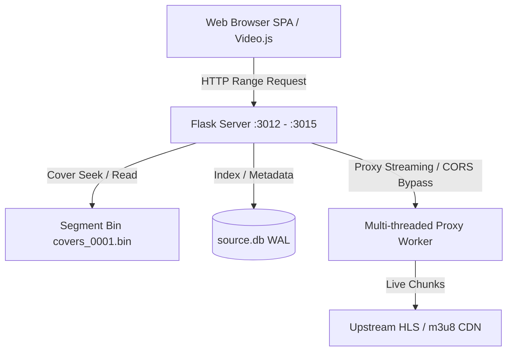

# Crawl VOD - Kiến Trúc Hệ Thống (Architecture)

## 1. Mô hình tổng thể (System Overview)

## 2. Các phân hệ cốt lõi

### A. Phân giải ảnh bìa Segment Bin Không Tốn RAM (`/api/media`)
- Server thay thế hoàn toàn việc lưu trữ ảnh BLOB trong SQLite bằng cơ chế **Segment Bin Seek**.
- Khi client gọi `/api/media?id=<code_id>`:
  1. Server truy vấn SQLite lấy `cover_bin_id, cover_offset, cover_length`.
  2. Dùng `f.seek(cover_offset)` và `f.read(cover_length)` trực tiếp từ file nhị phân `*_covers_0001.bin`.
  3. Trả về ngay lập tức với header `Cache-Control: public, max-age=31536000, immutable` và độ trễ phản hồi < 1ms.

### B. Bộ phân giải mã nguồn & URL Resolver (`/api/video/<path:code>`)
- Hỗ trợ bắt toàn bộ đường dẫn ID đặc thù (`<path:code>`), phục vụ chính xác các nguồn có ID chứa dấu gạch chéo `/` như VLXX.
- Truy vấn không phân biệt hoa thường và hỗ trợ cả mã code lẫn tên DVD:
  `WHERE id = ? OR upper(id) = ? OR dvd = ? OR upper(dvd) = ? OR upper(title) LIKE ?`.
- Tự động lọc bỏ các UUID dummy hoặc dữ liệu rác.

### C. Proxy Phát Video Đa Luồng (`/api/proxy`)
- Đóng vai trò cầu nối giải quyết triệt để lỗi chặn CORS, Anti-hotlinking và Referer bảo vệ từ các CDN phát video (MissAV, Surrit, Playergo, v.v.).
- Tự động gắn Referer tương ứng theo từng máy chủ phát (`playergo.top` -> `missav99.com`, `surrit.com` -> `missav.ws`).
- Phục vụ playlist `.m3u8` và các phân đoạn `.ts` liền mạch, hỗ trợ Range Request và chunking linh hoạt.
